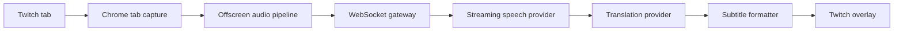

# Live Translator

Real-time translated subtitles for live Twitch streams — open Twitch, click once, understand the stream.


> Screenshot placeholders live under `docs/screenshots/`. Capture your own after loading the extension.

## Product summary

Live Translator is a Chrome Manifest V3 extension plus a Fastify realtime backend. It captures **only the active tab’s audio**, streams it to the backend, transcribes speech, translates finalized segments, and renders Netflix-style subtitles over the Twitch player.

- Preserves original Twitch audio
- Shadow DOM overlay (theater + fullscreen)
- Mock STT/translation providers for local development
- Provider-agnostic interfaces for production STT/MT
- No microphone access, no provider secrets in the extension

## Architecture overview



```text
Extension popup → service worker → offscreen document (PCM) → WS backend
                                                      ↘ content script overlay
```

## Repository structure

```text
live-translator/
├── apps/
│   ├── extension/     Chrome MV3 extension (Vite)
│   └── server/        Fastify + ws realtime API
├── packages/
│   ├── shared/        Audio utils, session FSM, subtitle formatter
│   ├── protocol/      Zod schemas + typed client/server events
│   ├── ui/            Small internal React components
│   └── config/        Shared TS/ESLint config
├── docs/
├── docker-compose.yml Optional Postgres + Redis
├── package.json
└── pnpm-workspace.yaml
```

## Local installation

Requirements: Node.js 20+, pnpm 9+.

```bash
# From repo root
corepack enable
pnpm install
cp .env.example .env
pnpm --filter @live-translator/protocol build
pnpm --filter @live-translator/shared build
pnpm --filter @live-translator/ui build
pnpm dev
```

`pnpm dev` starts:

- Extension Vite build watcher → `apps/extension/dist`
- Backend server on `http://127.0.0.1:4000`
- Mock speech + translation providers

## Load the Chrome extension

1. Open `chrome://extensions`
2. Enable **Developer mode**
3. Click **Load unpacked**
4. Select `apps/extension/dist`
5. Open a Twitch stream (e.g. `https://www.twitch.tv/<channel>`)
6. Click the extension icon → choose language → **Start Translation**

After code changes, click **Reload** on the extension card if the watcher has rebuilt.

## Environment configuration

Copy `.env.example` to `.env`:

| Variable | Default | Purpose |
| --- | --- | --- |
| `PORT` | `4000` | HTTP + WS port |
| `REALTIME_TOKEN_SECRET` | (dev) | HMAC secret for short-lived WS tokens |
| `DEV_AUTH_MODE` | `true` | Allows `dev-token` for local debugging |
| `SPEECH_PROVIDER` | `mock` | `mock` \| `openai` \| `deepgram` |
| `TRANSLATION_PROVIDER` | `mock` | `mock` \| `openai` |
| `OPENAI_API_KEY` | — | Used by real translation/speech adapters |
| `DEEPGRAM_API_KEY` | — | Reserved for Deepgram STT |
| `DATABASE_URL` / `REDIS_URL` | — | Optional; persistence abstractions are ready |
| `TRANSCRIPT_CORRECTION_ENABLED` | `true` | Low-confidence STT correction pipeline |
| `TRANSCRIPT_CONFIDENCE_THRESHOLD` | `0.72` | Retranscribe when provider confidence is below this |
| `RETRANSCRIBE_TIMEOUT_MS` | `2500` | Whisper re-transcription timeout (falls back to raw) |
| `AUDIO_BUFFER_MAX_SECONDS` | `45` | Bounded PCM ring buffer for selective re-STT |
| `RETRANSCRIBE_PROVIDER` | `mock` | `mock` \| `openai` \| `none` (set `openai` in production) |

## Mock provider usage

With `SPEECH_PROVIDER=mock` and `TRANSLATION_PROVIDER=mock`:

1. Start the stack with `pnpm dev`
2. Load the extension and open a Twitch stream
3. Click **Start Translation**
4. The offscreen document captures tab audio and sends PCM frames
5. The mock STT emits sample English segments every ~2.8s (once audio is flowing)
6. The mock translator returns Turkish (or other mapped) lines
7. Subtitles appear over the player

You can also exercise the backend alone:

```bash
pnpm --filter @live-translator/server test
```

## Game-aware translation

Live Translator detects the Twitch category/game and applies a terminology profile so subtitles sound like natural Turkish gaming speech — without translating official names like `Ground Slam` into awkward dictionary Turkish.

### How detection works

1. The Twitch adapter reads category metadata from the page (`stream-game-link`, title fallbacks).
2. `streamContext` is sent on `session.start` and updated via `stream.context.update` on SPA navigation / category changes.
3. The server resolves the game through deterministic aliases (no LLM).
4. A matching profile is loaded from memory cache (or `generic-gaming` as fallback).

### Profile selection

```text
Exact / alias match → specialized profile
Else → generic-gaming
```

Current profiles:

- `generic-gaming`
- `path-of-exile` (detailed starter)
- `league-of-legends`
- `valorant`
- `counter-strike-2`

Profiles live in `apps/server/src/game-context/profiles/`.

### Preserve vs preferred translation

| Behavior | Example | Result |
| --- | --- | --- |
| Preserve | `Divine Orb`, `Ground Slam` | Keep English exactly |
| Preferred | `mapping` → `map dönmek` | Community phrasing |
| Contextual | `build` in PoE | Stay as `build` |

### Translation memory

Per-session memory keeps terminology consistent. Priority:

```text
User → Game profile → Community → Session memory → Provider
```

(MVP implements profile + session memory; user/community are data-model ready.)

### Add a new game profile

1. Create `apps/server/src/game-context/profiles/my-game.json` matching the Zod schema.
2. Register it in `profiles/index.ts`.
3. Add aliases that match Twitch category names.
4. Restart the server — invalid profiles fail loudly at startup.

### Test game-aware translation

```bash
pnpm --filter @live-translator/server test
```

Manual: open a Path of Exile Twitch stream, start translation, confirm popup shows `Path of Exile context active` and terms like `Ground Slam` stay English.

## Transcript correction

After a final streaming STT segment, the server can selectively improve low-confidence transcripts before translation:

```text
Final STT segment
→ quality evaluation (confidence / mild heuristics)
→ audio extract + high-quality re-transcription (low confidence only)
→ game-aware phonetic normalization (deterministic, local)
→ translateSegment(textForTranslation) → existing subtitle events
```

- Raw and corrected text are stored separately per session and cleared on `session.stop`.
- Translation uses the corrected transcript when valid; otherwise raw.
- High-confidence segments skip re-transcription (no regression to the existing path).
- Re-transcription timeouts fall back to raw, then still run normalization.
- PoE example: `serious` is **not** blindly replaced with `Sirus` — only when contextual cues appear (boss, fight, atlas, maven, …). `seriously` is never matched (word boundary).
- **Normalization is not a provider.** There is no `NORMALIZER_PROVIDER`. `RETRANSCRIBE_PROVIDER=openai` is sufficient for the Whisper hop; phonetic aliases come from the game profile.

### Topic-aware routing

When `TOPIC_ROUTING_ENABLED=true` (default), each **assembled** utterance is classified as game / general / uncertain before translation (see Sentence assembly below for hold/merge):

```text
Assembled utterance
→ quality + optional re-transcription (phonetic normalize skipped)
→ final topic classify → topicState.update
→ resolve route (game-aware | general | conservative)
→ route-specific normalize
→ optional one refinement classify if text changed and topic was uncertain
→ route-aware translate → one translation.final (protocol unchanged)
```

- **general** — conversational prompt only; no game terminology, examples, or phonetic aliases (e.g. `serious` stays `serious`).
- **game-aware** — existing PoE/game profile path with full terminology protection.
- **conservative** — stream may be in-game but the sentence is ambiguous; match terms only if they appear explicitly.
- When routing is disabled, behavior matches the previous pipeline (full phonetic normalize + game-aware translate).

### Sentence assembly

When `SENTENCE_ASSEMBLY_ENABLED=true` (default), incomplete STT fragments are held briefly and merged into one utterance before correction and translation:

```text
Final STT fragment → transcript.final (per fragment)
→ preliminary topic classify (no topic-state update yet)
→ hold / merge incomplete fragments (complete sentences flush immediately)
→ quality eval + optional re-transcription on assembled span
→ final topic classify → topicState.update → route normalize → one translation.final
```

- Each STT fragment still emits `transcript.final`; only one `translation.final` is produced per assembled utterance.
- Complete sentences (terminal punctuation / complete-clause heuristics) do not wait.
- Game change and session stop flush any pending hold safely, then clear.
- Hold / merge diagnostics are logged without full transcript text in production.

### Production `.env` (real path)

```text
NODE_ENV=production
DEV_AUTH_MODE=false
REALTIME_TOKEN_SECRET=<long-random-secret>
SPEECH_PROVIDER=deepgram
DEEPGRAM_API_KEY=...
DEEPGRAM_MODEL=nova-2
TRANSLATION_PROVIDER=openai
OPENAI_API_KEY=...
TRANSCRIPT_CORRECTION_ENABLED=true
TRANSCRIPT_CONFIDENCE_THRESHOLD=0.72
RETRANSCRIBE_TIMEOUT_MS=2500
RETRANSCRIBE_PROVIDER=openai
AUDIO_BUFFER_MAX_SECONDS=45
AUDIO_SAMPLE_RATE=16000
AUDIO_CHANNELS=1
```

| Concern | Real provider | Mock / local |
| --- | --- | --- |
| Streaming STT | `SPEECH_PROVIDER=deepgram` | `mock` |
| Re-transcription | `RETRANSCRIBE_PROVIDER=openai` | `mock` / `none` |
| Normalization | deterministic profile aliases | (no mock provider exists) |
| Translation | `TRANSLATION_PROVIDER=openai` | `mock` |

### Deepgram adapter metadata (current implementation)

| Capability | Status |
| --- | --- |
| Segment confidence | Yes (`alternatives[0].confidence`) |
| Word confidence | Parsed when Deepgram includes `words[]` (no extra query flag) |
| Word timestamps | Parsed when present on `words[]` |
| Segment start/end | Yes (`start` + `duration`) |
| Vocabulary / keyterm hints | **Not configured** |

### Audio ring buffer memory

PCM `s16le`, mono, 16 kHz, 45 s max:

```text
16000 × 1 × 2 bytes × 45 s = 1,440,000 bytes ≈ 1.37 MiB per session
```

### Development transcript diagnostics

Non-production only (404 in production):

- `GET /api/diagnostics` — providers, readiness warnings, buffer estimate, per-session aggregate metrics (no transcript text)
- `GET /api/diagnostics/transcript/:sessionId` — per-segment raw / re-transcribed / corrected / translated text + latencies

Set `LOG_LEVEL=debug` to also emit `transcript_segment_diagnostics` in development. Production logs never include transcript or audio payloads.

### Speech-to-text

Edit / implement:

- `apps/server/src/speech/speech-provider.ts` — interface
- `apps/server/src/speech/providers/openai-speech-provider.ts` — adapter stub
- Wire in `apps/server/src/speech/mock-speech-provider.ts` → `createSpeechProvider()`

Set `SPEECH_PROVIDER=openai` (or `deepgram`) and the matching API key in `.env`.

### Translation

Edit / implement:

- `apps/server/src/translation/translation-provider.ts` — interface
- `apps/server/src/translation/providers/openai-translation-provider.ts` — working OpenAI adapter
- Wire `createTranslationProvider()` / session manager to construct `OpenAiTranslationProvider` when configured

Set `TRANSLATION_PROVIDER=openai` and `OPENAI_API_KEY=...`.

**Never** put provider API keys in the extension, manifest, or client env.

## Testing commands

```bash
pnpm typecheck
pnpm lint
pnpm test
pnpm build
```

Package-scoped:

```bash
pnpm --filter @live-translator/protocol test
pnpm --filter @live-translator/shared test
pnpm --filter @live-translator/server test
pnpm --filter @live-translator/extension test
```

## Privacy model

- Only the **selected tab** audio is processed
- Processing runs **only while translation is active**
- Raw audio and transcripts are **not stored by default** (session-local correction buffers are cleared on stop)
- Stopping translation ends capture, closes the WebSocket, and clears buffers
- Microphone is never requested

## Known MVP limitations

- Chrome only (Manifest V3)
- Twitch adapter only (YouTube/Kick hooks are architected, not implemented)
- Mock STT does not decode real speech — it emits deterministic sample segments when audio bytes arrive
- Deepgram live STT is implemented; OpenAI streaming STT remains a lighter adapter. Selective Whisper re-transcription runs only for low-confidence finals when `RETRANSCRIBE_PROVIDER=openai`
- No accounts, billing, or long-term transcript history (session-local correction store only)
- Tab capture requires an active user gesture / active tab context
- Host permission includes `localhost:4000` for local API access

## Manual verification checklist

Browser APIs (`tabCapture`, offscreen, Twitch DOM) cannot be fully automated here. After `pnpm dev`:

1. [ ] Extension loads unpacked without errors
2. [ ] Popup shows “Twitch stream detected” on a live channel
3. [ ] Turkish selectable; Start begins a session
4. [ ] Twitch audio continues playing
5. [ ] Server logs `ws_connected` / `session_started`
6. [ ] Subtitles appear; theater + fullscreen still positioned
7. [ ] SPA navigate to another channel → no duplicate overlays
8. [ ] Stop closes WS and clears overlay
9. [ ] Kill server briefly → reconnecting copy → recovery or Try Again
10. [ ] Reload popup → reflects current session state
11. [ ] Settings persist after browser restart

## Future roadmap

- YouTube Live / Kick adapters
- Production STT (Deepgram / OpenAI Realtime)
- Accounts, plans, usage metering UI
- Bilingual polish + more languages
- Firefox support
- Optional transcript history (explicit opt-in)

## License

Private MVP — all rights reserved.
