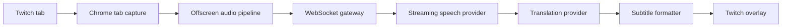

# Live Translator

Real-time translated subtitles for live Twitch streams — open Twitch, click once, understand the stream.


> Screenshot placeholders live under `docs/screenshots/`. Capture your own after loading the extension.

## Product summary

Live Translator is a Chrome Manifest V3 extension plus a Fastify realtime backend. It captures **only the active tab’s audio**, streams it to the backend, transcribes speech, translates finalized segments, and renders Netflix-style subtitles over the Twitch player.

- Preserves original Twitch audio
- Shadow DOM overlay (theater + fullscreen)
- Mock STT/translation providers for local development
- Provider-agnostic interfaces for production STT/MT
- No microphone access, no provider secrets in the extension

## Architecture overview



```text
Extension popup → service worker → offscreen document (PCM) → WS backend
                                                      ↘ content script overlay
```

## Repository structure

```text
live-translator/
├── apps/
│   ├── extension/     Chrome MV3 extension (Vite)
│   └── server/        Fastify + ws realtime API
├── packages/
│   ├── shared/        Audio utils, session FSM, subtitle formatter
│   ├── protocol/      Zod schemas + typed client/server events
│   ├── ui/            Small internal React components
│   └── config/        Shared TS/ESLint config
├── docs/
├── docker-compose.yml Optional Postgres + Redis
├── package.json
└── pnpm-workspace.yaml
```

## Local installation

Requirements: Node.js 20+, pnpm 9+.

```bash
# From repo root
corepack enable
pnpm install
cp .env.example .env
pnpm --filter @live-translator/protocol build
pnpm --filter @live-translator/shared build
pnpm --filter @live-translator/ui build
pnpm dev
```

`pnpm dev` starts:

- Extension Vite build watcher → `apps/extension/dist`
- Backend server on `http://127.0.0.1:4000`
- Mock speech + translation providers

## Load the Chrome extension

1. Open `chrome://extensions`
2. Enable **Developer mode**
3. Click **Load unpacked**
4. Select `apps/extension/dist`
5. Open a Twitch stream (e.g. `https://www.twitch.tv/<channel>`)
6. Click the extension icon → choose language → **Start Translation**

After code changes, click **Reload** on the extension card if the watcher has rebuilt.

## Environment configuration

Copy `.env.example` to `.env`:

| Variable | Default | Purpose |
| --- | --- | --- |
| `PORT` | `4000` | HTTP + WS port |
| `REALTIME_TOKEN_SECRET` | (dev) | HMAC secret for short-lived WS tokens |
| `DEV_AUTH_MODE` | `true` | Allows `dev-token` for local debugging |
| `SPEECH_PROVIDER` | `mock` | `mock` \| `openai` \| `deepgram` |
| `TRANSLATION_PROVIDER` | `mock` | `mock` \| `openai` |
| `OPENAI_API_KEY` | — | Used by real translation/speech adapters |
| `DEEPGRAM_API_KEY` | — | Reserved for Deepgram STT |
| `DATABASE_URL` / `REDIS_URL` | — | Optional; persistence abstractions are ready |

## Mock provider usage

With `SPEECH_PROVIDER=mock` and `TRANSLATION_PROVIDER=mock`:

1. Start the stack with `pnpm dev`
2. Load the extension and open a Twitch stream
3. Click **Start Translation**
4. The offscreen document captures tab audio and sends PCM frames
5. The mock STT emits sample English segments every ~2.8s (once audio is flowing)
6. The mock translator returns Turkish (or other mapped) lines
7. Subtitles appear over the player

You can also exercise the backend alone:

```bash
pnpm --filter @live-translator/server test
```

## Real provider configuration

### Speech-to-text

Edit / implement:

- `apps/server/src/speech/speech-provider.ts` — interface
- `apps/server/src/speech/providers/openai-speech-provider.ts` — adapter stub
- Wire in `apps/server/src/speech/mock-speech-provider.ts` → `createSpeechProvider()`

Set `SPEECH_PROVIDER=openai` (or `deepgram`) and the matching API key in `.env`.

### Translation

Edit / implement:

- `apps/server/src/translation/translation-provider.ts` — interface
- `apps/server/src/translation/providers/openai-translation-provider.ts` — working OpenAI adapter
- Wire `createTranslationProvider()` / session manager to construct `OpenAiTranslationProvider` when configured

Set `TRANSLATION_PROVIDER=openai` and `OPENAI_API_KEY=...`.

**Never** put provider API keys in the extension, manifest, or client env.

## Testing commands

```bash
pnpm typecheck
pnpm lint
pnpm test
pnpm build
```

Package-scoped:

```bash
pnpm --filter @live-translator/protocol test
pnpm --filter @live-translator/shared test
pnpm --filter @live-translator/server test
pnpm --filter @live-translator/extension test
```

## Privacy model

- Only the **selected tab** audio is processed
- Processing runs **only while translation is active**
- Raw audio and transcripts are **not stored by default**
- Stopping translation ends capture, closes the WebSocket, and clears buffers
- Microphone is never requested

## Known MVP limitations

- Chrome only (Manifest V3)
- Twitch adapter only (YouTube/Kick hooks are architected, not implemented)
- Mock STT does not decode real speech — it emits deterministic sample segments when audio bytes arrive
- Real OpenAI/Deepgram STT streaming is stubbed; OpenAI translation adapter is implemented but not the default
- No accounts, billing, or transcript history
- Tab capture requires an active user gesture / active tab context
- Host permission includes `localhost:4000` for local API access

## Manual verification checklist

Browser APIs (`tabCapture`, offscreen, Twitch DOM) cannot be fully automated here. After `pnpm dev`:

1. [ ] Extension loads unpacked without errors
2. [ ] Popup shows “Twitch stream detected” on a live channel
3. [ ] Turkish selectable; Start begins a session
4. [ ] Twitch audio continues playing
5. [ ] Server logs `ws_connected` / `session_started`
6. [ ] Subtitles appear; theater + fullscreen still positioned
7. [ ] SPA navigate to another channel → no duplicate overlays
8. [ ] Stop closes WS and clears overlay
9. [ ] Kill server briefly → reconnecting copy → recovery or Try Again
10. [ ] Reload popup → reflects current session state
11. [ ] Settings persist after browser restart

## Future roadmap

- YouTube Live / Kick adapters
- Production STT (Deepgram / OpenAI Realtime)
- Accounts, plans, usage metering UI
- Bilingual polish + more languages
- Firefox support
- Optional transcript history (explicit opt-in)

## License

Private MVP — all rights reserved.
